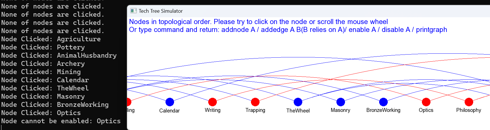

# Tech Tree Simulator
Repo Link: https://github.com/cloud-sail/TechTreeSimulator  
This project is a Tech Tree Simulator written in C++ using the SFML library. You can create any number of nodes and manage the dependencies between them, featuring an intuitive user interface organized in a topological sort order.

The technology tree relationships from the game **Civilization** (Ancient Era to Medieval Era)

This document highlights the sophisticated use of C++ and SFML in building a complex and interactive application, demonstrating a solid grasp of object-oriented programming, design patterns, and modern C++ practices.

## Project Highlights
### Advanced C++ Usage
* Smart Pointers: Ensures proper resource management.
* STL Containers: Efficient data handling and manipulation.
* RAII: Resource management in constructors/destructors.

### MVC Design Pattern
* Controller (`Game.cpp`): Manages the game loop, processes user input, and coordinates between the Model and View.
* Model (`World.cpp`, `Graph.cpp`): Represents the logic and data structure of the technology tree using a directed acyclic graph (DAG).
* View (`Screen.cpp`): Responsible for displaying the game interface, including user inputs and the visual representation of the technology tree.

### SFML
* The code is written in C++ and utilizes the SFML (Simple and Fast Multimedia Library). SFML provides basic rendering and input handling functionalities. 
* The fundamental game loop is implemented: processInput, update, and render. And these three parts can be assigned to Controller, Model, and View.

## Class Design

#### `Game` (Controller)
- **Responsibilities**:
  - Initializes the game environment.
  - Reads from and writes to `resource.txt`.
  - Handles user input for interactivity.
    - window close events
    - mouse scroll events
    - text input events
    - mouse button-clicked events
- **Techniques**:
  - Smart pointers (`std::shared_ptr`) for resource management.
  - Event-driven programming for input handling.
  - RAII principle for resource loading and saving.

#### `World` (Model)
- **Responsibilities**:
  - Manage all submodels
- **Techniques**:
  - get submodel

#### `Graph` (Model)
- **Responsibilities**:
  - Stores nodes and their relationships.
  - Supports operations like adding nodes/edges and toggling node states.
  - Manages the DAG representing the technology tree.
  - Processes user commands.
- **Techniques**:
  - Use of STL containers (`std::unordered_map`, `std::vector`).
  - Algorithms for topological sorting and subtree traversal.
  - Encapsulation of the graph logic.
  - Providing a clear interface for graph manipulation.

#### `Screen` (View)
- **File**: `Screen.h`
- **Responsibilities**:
  - Renders the technology tree.
  - Displays user input and operational prompts.
- **Techniques**:
  - SFML for graphical rendering.
  - Separation of game and HUD views.
  - Custom rendering logic for DAG visualization.

## Tables Representing Class Structures

### Game (Controller)

| Method                  | Description |
|-------------------------|-------------|
| Game()                  | Constructor initializing the game environment |
| ~Game()                 | Destructor handling resource saving |
| run()                   | Main game loop |
| readResource()          | Reads initial game data from a file |
| writeResource()         | Writes game state to a file |
| handleEvent()           | Central event handler |
| handleCloseEvent()      | Handles window close events |
| handleMouseWheelScrolledEvent() | Handles mouse scroll events |
| handleTextEnteredEvent() | Handles text input events |
| handleMouseButtonPressedEvent() | Handles mouse button events |

### World (Model)

| Method                  | Description |
|-------------------------|-------------|
| World()                 | Constructor initializing the world state |
| getGraph()              | Returns a reference to the graph |

### Graph (Part of Model)

| Method                  | Description |
|-------------------------|-------------|
| addNode()               | Adds a new node to the graph |
| addEdge()               | Creates an edge between two nodes |
| disableNode()           | Disables a node |
| enableNode()            | Enables a node |
| printGraph()            | Prints the graph structure |
| processUserInput()      | Processes and executes user commands |
| getTopologicalOrder()   | Returns nodes in topological order |
| toggleNode()            | Toggles the state of a node |
| ~Graph()                | Destructor to manage resources |

### Screen (View)

| Method                  | Description |
|-------------------------|-------------|
| Screen()                | Constructor initializing the view |
| moveView()              | Moves the game view based on user input |
| setUserInput()          | Sets current user input text |
| getNodeAtMousePosition()| Returns the node at the mouse position |
| draw()                  | Renders the game and HUD views |

## How to use
* Please navigate to the 'testcase' folder and run ResourceManagerApp.exe. 
* Make sure that the 'resource.txt' file and 'Fonts/arial.ttf' are present in the same directory.

The format in `resource.txt` is either: `Child Parent` or `Node`

Once executed, you will see a topologically sorted directed acyclic graph.

There are several ways to operate the application:

* Click on nodes to enable/disable them using the mouse.
* Scroll the mouse wheel to move the canvas horizontally and view more nodes.
* Use the following keyboard commands (only allowing letters, numbers, spaces, and the Enter key). Enter to confirm the command. The entered commands will be displayed on the screen:
  * addnode A
  * addedge A B (B relies on A)
  * enable A
  * disable A
  * printgraph

## Example
### Scroll the mouse
Scroll the view to see more nodes  
 

### Click on nodes
> red: node disabled  
> blue: node enabled  
> All nodes are enabled when entering the program.
> click on a node to toggle its status between `enabled` and `disabled`  
> program will check whether all parents of the node are enabled, before enabling the node
> when disable one node, all their descendants are disabled.

#### Case 1
When clicked on `Agriculture` which is the root of the whole Directed Acyclic Graph, all nodes are disabled, because all nodes rely on the root node. 

#### Case 2
Activate the talent tree in the order shown in the game screenshot
  
  

#### Case 3
Click on `Optics`. Node will not be enabled, because `Sailing` is disabled.

#### Case 4
Add node from A to G  
`addedge E G`

`disable A`

`enable A`
